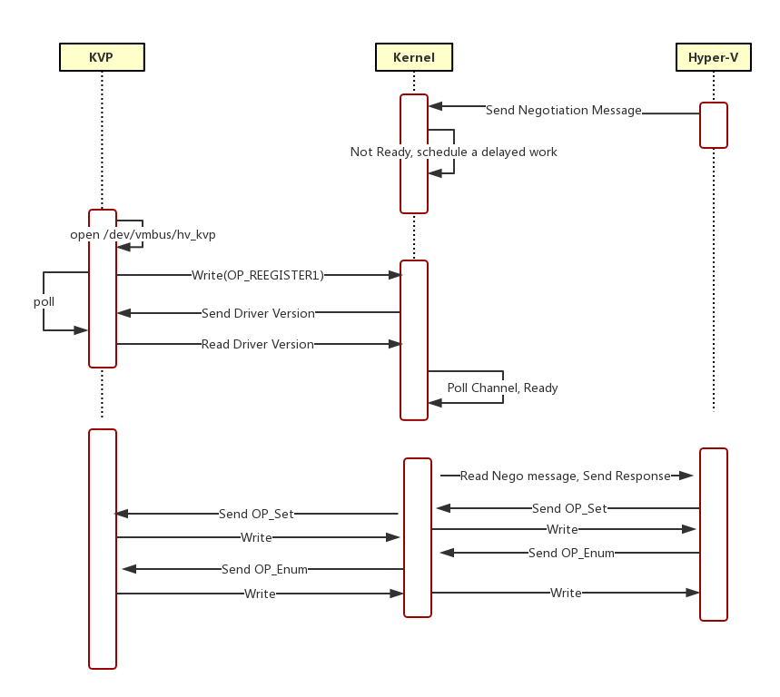

## 1 问题

最近发现我们4.4的kernel在Hyper-V上KVP不能正常工作，但是奇怪的只有数据没有被update 到/var/lib/hyperv/.kvp_pool_*中，其他的功能貌似一切正常。

KVP其实是user space中的一个daemon，负责和kernel进行通信，传递一些数据。我们知道在virtualization中，Hypervisor是不能直接访问guest的数据的，但是我们在数据中心的管理中需要知道VM的某些数据，比如VM的IP。当然这只是其中的一项功能。不能的虚拟化平台一般都会提供类似的一个daemon，如在VMware的openvmtools。

进一步扩大到cloud平台中，各大cloud vendor也提供了”更高层次“的tool，如Azure 中的VM要安装[WALinuxAgent](https://github.com/Azure/WALinuxAgent), Google Cloud Platform(GCP) 有[Linux Guest Environment](https://github.com/GoogleCloudPlatform/compute-image-packages)。理念其实都是类似的。

## 2 Root Cause

这个问题本身不难debug，原因也挺简单的。其实就是在相互通信中的某些消息丢失了，导致了该问题。具体的分析可参考这个[github issue](https://github.com/LIS/lis-next/issues/593)。下面将主要分析KVP如何实现user space， kernel space 和Hypervisor 之间的通信。

## 3.1 How KVP and Kernel communication

KVP daemon 和Kernel 是通过一个设备(/dev/vmbus/hv_kvp)进行通信的，KVP daemon可以对该设备open，poll，read，write 和close。该设备在KVP 初始化时被创建

```C
hv_kvp_init
        hvt = hvutil_transport_init
                ...
                hvt->fops.owner = THIS_MODULE;
                hvt->fops.read = hvt_op_read;
                hvt->fops.write = hvt_op_write;
                hvt->fops.poll = hvt_op_poll;
                hvt->fops.open = hvt_op_open;
                hvt->fops.release = hvt_op_release;
                hvt->mdev.fops = &hvt->fops;
                misc_register
                ...
```
read：阻塞在一个工作队列上，如果有消息，则copy到user space，如果该read 设置了callback，则会调用callback。
write：copy 数据到内核空间，如果该write设置了callback，调用callback。
poll：在该fd上poll。

## 3.2 How Kernel and Hyper-V communication

Kernel 和Hyper-V主要是通过Hypercall进行通信，具体来说就是下面2个API:

```C
vmbus_recvpacket(...);
vmbus_sendpacket(...);
```

## 4.1 KVP communication sequence

1. 一般来说，当hv_utils driver 注册以后，Hyper-V就会向Kernel发送Negotiation Mesage，但是此时，user daemon并不一定Ready，因此，如果此时user daemon not ready，那么kernel会设置一个dealyed work，该work 会在50s后schedule一个tasklet，该tasklet会去poll channel。

2. 当user daemon注册，完成handshake，设置状态为Ready。

3. Kernel 读取Hyper-V发来的message，转发给user daemon，user daemon便会response kernel， kernel会response给Hyper-V。

下面是一个简单的时序图：



## 4.2 KVP state transaction

下面是KVP state machine：


1. hv_utils 完成注册，状态变为DEVICE_INIT。

2. 此时，host会发来negotiation version的消息，如果user 没有ready，则pending 在此状态
(hv_kvp_onchannelcallback)。

3. 如果user daemon注册，和kernel完成handshake，则状态变为READY.
(kvp_on_msg -> kvp_handle_handshake -> kvp_register_done)

4. READY状态读取host 发来的message，完成negotiation version。
(hv_kvp_onchannelcallback).

5. READY状态下读取message，状态变为HOSTMSG_RECEIVED.
(hv_kvp_onchannelcallback).

6. 发送给user daemon后，状态变为USERSPACE_REQ.
(kvp_send_key)

7. user daemon 读取并回应，kernel接收后，状态变为USERPSACE_RECV.
(kvp_on_msg)

8. kernel回应host，变为READY.
(kvp_respond_to_host, hv_poll_channel -> kvp_poll_wrapper)
